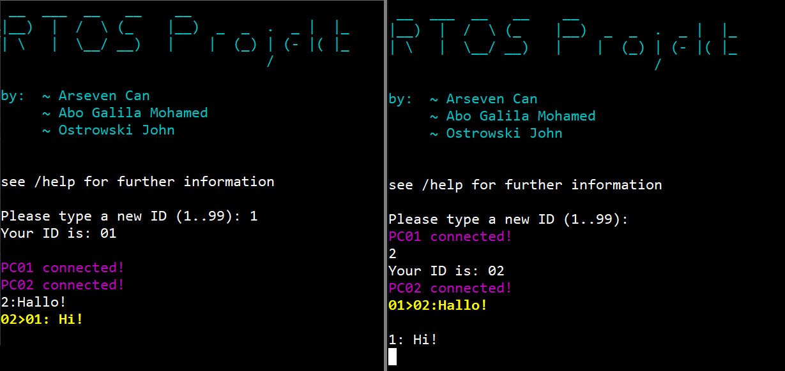

# Mesh-Network over USART

This project uses the MicroController `STM32F401` and the RealTime Operating System `FreeRTOS` to implement a Mesh Network over USART.
A PC can connect over a terminal program with the Microcontroller (for best experience please use `TeraTerm`) and send messages over the terminal interface to the other connected PCs.

```
                                ┌───┐        ┌───┐                              ╔════╗  reveive:
                                |STM|________|STM|                 ┌───┐        ║PC 2║  PC1: "Hello PC2"
                                └───┘        └───┘                 |STM|________║    ║
                                 /             /                   └───┘        ╚════╝
                                /             |                  ___/              
                               /              /          ┌───┐__/                      
                              /              |       ____|STM|___                     
            ╔════╗           /              ┌───┐___/    └───┘   \                       
send PC2:   ║PC 1║        ┌───┐       ______|STM|                  \      ┌───┐            
"Hello PC2" ║    ║________|STM|_____/       +───┘                   \_____|STM|            
            ╚════╝        └───┘                                           └───┘
```

The RealTime operating system allows the software to be decupled of the hardware layer underneath. So theoretically this program can be ported to other MicroControllers that implement FreeRTOS. This also allows to let different types of Microcontroller to talk to one and another over USART.

Here is the terminal initial interface view:
```
 __  ___  __   __    __
|__)  |  /  \ (_    |__)  _  _  .  _ |  |_
| \   |  \__/ __)   |    |  (_) | (- |( |_
                                /

by:  ~ Arseven Can
     ~ Abo Galila Mohamed
     ~ Ostrowski John

see /help for further information

> Please type a new ID (1..99): 1
Your ID is: 01
PC01 connected!

> /help
To send a message you need to first define your own ID (1..99)
Then you can send a message with:
XX: your_message
(XX is the ID of the receiver)

other possible commands:
/blink    -> blink the LED
/release  -> to release ID
/showDB   -> to show the database
/resetDB  -> reset the database
/hello    -> ask neighbor for update
/clear    -> clear terminal screen
/credits  -> show creators
/help     -> show this message again
```
We can see that we first have to enter our ID. This can be a value between 1 and 99. The program will notice if this ID already exists in the network and will prompt you to choose another ID number.

If another PC connects to the network the terminal will notify you about that.

You can send messages with the command: `XX: your message` where as `XX` stands for the ID of the receiver ID.
This project is only a proof of concept and the program will sadly only allow the text to be 40 characters long.



## How it works
The routing is done on the basics of a very simple distance vector routing principle similar to RIPv1. It uses the PC ID, the hop count and the ingoing interface to determine the route of a message.

<p align="center">
  
</p>

## How to install

coming soon.
